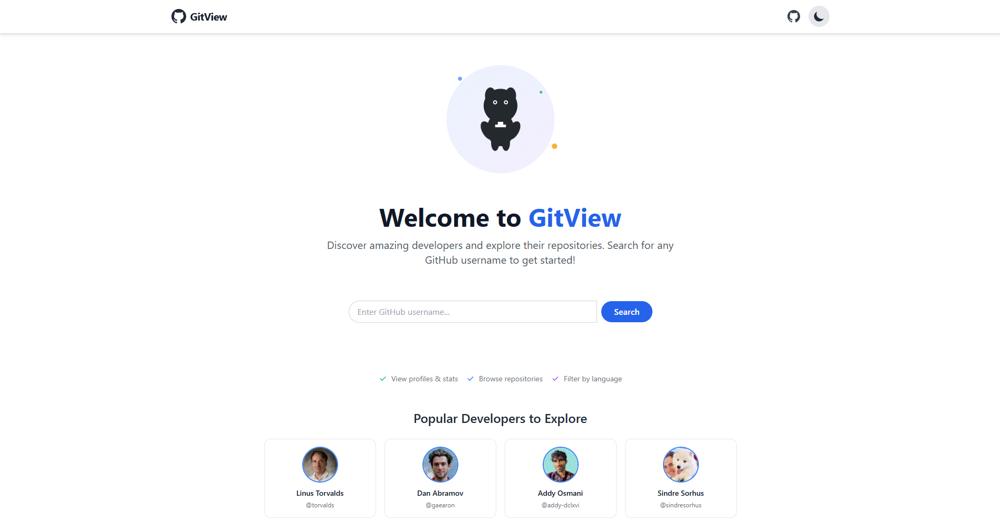
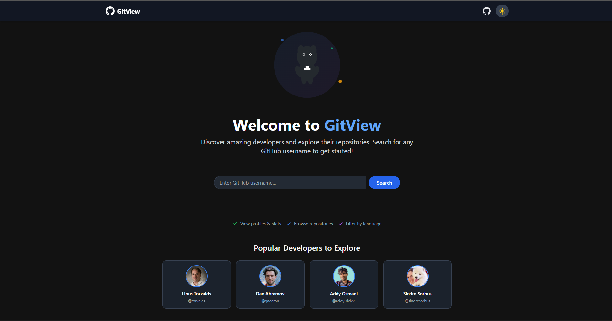
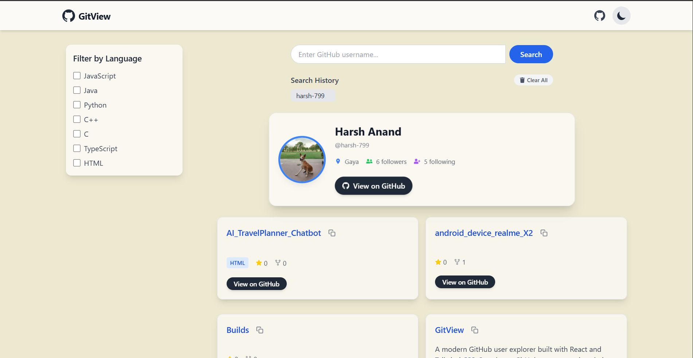
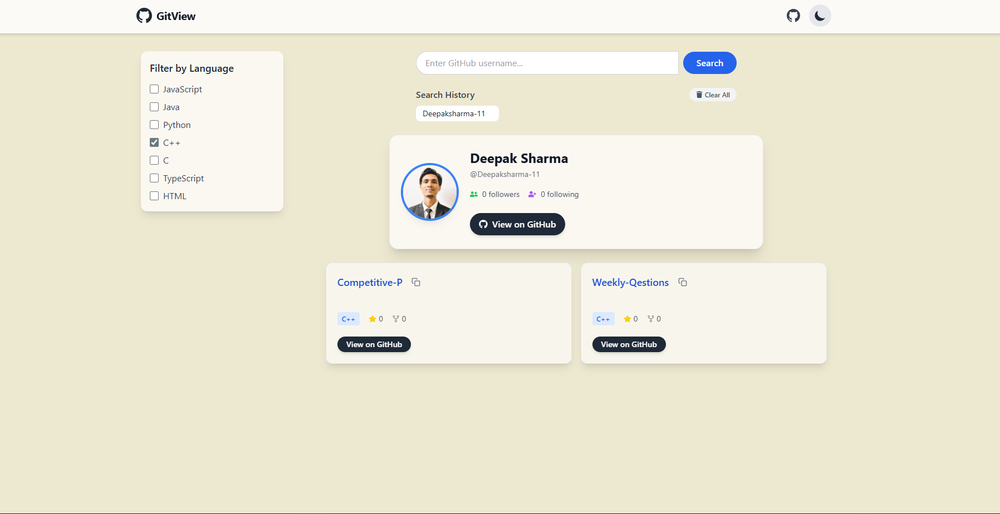
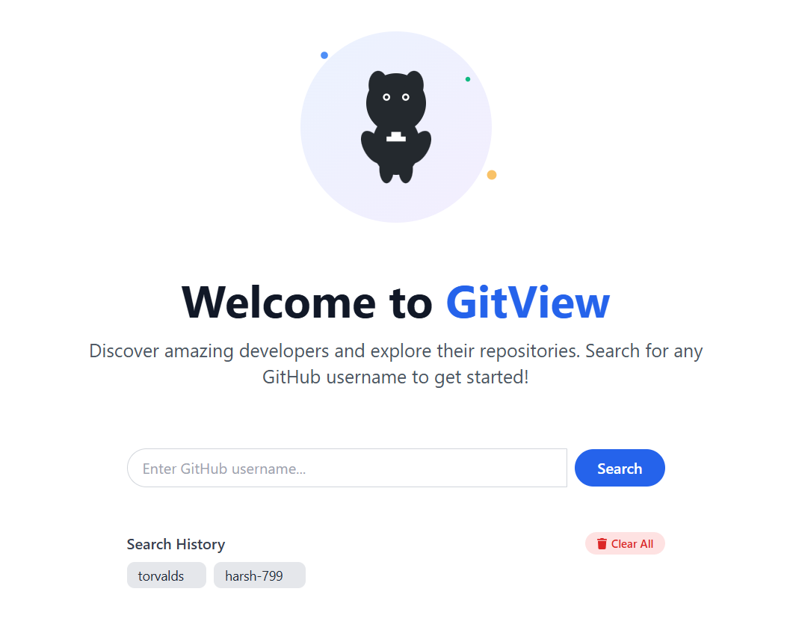

# 🚀 GitView – GitHub User Explorer

**GitView** is a sleek and modern GitHub user explorer built using **React** and **Tailwind CSS**.  
It allows you to search for any GitHub user, view their profile details, explore their public repositories, and filter them based on programming languages — all in a beautiful, responsive UI with dark mode support.

---

## 🖼️ Preview



---

## 🌐 Live Demo

### 👉 [Click here](https://gitview-app.netlify.app/)

## ✨ Features

- 🔍 Search any GitHub username
- 👤 View detailed user profile (avatar, name, bio, location, followers, following)
- 📦 Browse public repositories with:
  - Name, description, language, stars
- 🧠 Language-based repo filtering (JavaScript, Python, C++, etc.)
- 🌙 Light & Dark mode toggle (stored in localStorage)
- 🕘 Search history (last 5 users)
- ⚠️ "User not found" animated error screen
- 💡 Responsive layout with modern UI and subtle animations

---

## 📸 Screenshots

| Home / Search | User Profile + Repos |
|---------------|-----------------------|
|  |  |

| Filter Search | History |
|----------------|---------|
|  |  | 

---

## 🛠️ Built With

- [React](https://reactjs.org/)
- [Tailwind CSS](https://tailwindcss.com/)
- [GitHub REST API](https://docs.github.com/en/rest)
- [localStorage API](https://developer.mozilla.org/en-US/docs/Web/API/Window/localStorage)

---

## 🔧 Setup Instructions

1. **Clone the repository:**

   ```bash
   git clone https://github.com/Deepaksharma-11/GitView.git
   cd GitView

2. **Install dependencies:**

    ```
    npm install
    ```

3. **Start the development server:**

    ```
    npm start
    ```

## 📁 Folder Structure
```
GitView/
├── node_modules/
├── assets/
│   └── screensots/
│        ├──filter.png
         ├──history.png
│        ├──homedark.png
│        ├──homelight.png
│        └──userprofile.png
│
├── public/
│   ├── github-mark.svg
│   ├── index.html
│   ├── logo192.png
│   ├── logo512.png
│   ├── manifest.json
│   └── robots.txt
│
├── src/
│   ├── components/
│   │   ├── Navbar.js
│   │   ├── NotFound.js
│   │   ├── RepoCard.js
│   │   ├── SearchBar.js
│   │   ├── SearchHistory.js
│   │   ├── SidebarFilters.js
│   │   ├── UserProfileCard.js
│   │   └── WelcomeSection.js
│   │
│   ├── App.js
│   ├── index.css
│   └── index.js
│
├── .gitignore
├── package-lock.json
├── package.json
├── postcss.config.js
└── tailwind.config.js
```

## 🤝 Contributing

Pull requests are welcome. Open an issue first to discuss major changes.
